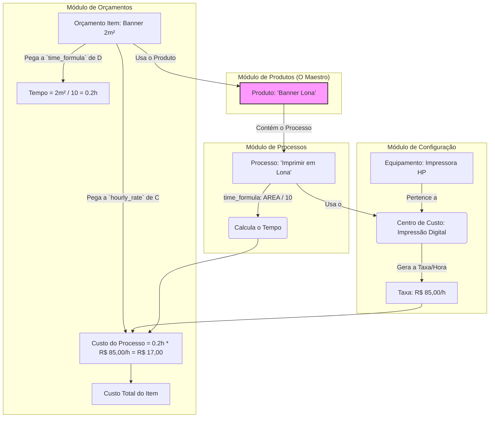

### **DOCUMENTO DE APOIO: A GRANDE CONEXÃO - COMO OS MÓDULOS SE UNEM NO PRODUTO**

**Título:** Arquitetura do Custo: O Produto como Elo entre os Módulos do ERP

**Objetivo:** Este guia destina-se a fornecer ao agente de IA (Cursor) a visão macro de como os diferentes módulos do CactusFlow (`Equipamentos`, `Processos`, `Acabamentos`, `Terceirizados`) são configurados de forma independente para, no final, serem **orquestrados e conectados através do Cadastro de Produtos**. O produto não existe isoladamente; ele é uma receita que combina ingredientes de todo o sistema para determinar o custo final em um **Orçamento**.

---

#### **1. A Filosofia: "Cadastre uma Vez, Use em Todo Lugar"**

A lógica do sistema é evitar redundância. Você não define o custo de uma impressora dentro de cada produto que a usa. Em vez disso:
1.  Você cadastra o **Equipamento** uma vez, com seus custos e capacidades.
2.  Você cadastra o **Processo** ("Imprimir em Lona") uma vez, e o vincula ao equipamento.
3.  No **Produto** ("Banner em Lona"), você simplesmente diz: "Use o processo 'Imprimir em Lona'".

O sistema, então, sabe como conectar tudo para calcular o custo. O **Cadastro de Produto é o "maestro"** que aponta para os músicos corretos na orquestra.

---

#### **2. A Jornada do Custo: Do Chão de Fábrica ao Orçamento**

Vamos seguir o fluxo de informação, módulo por módulo, até chegar ao orçamento.

##### **Módulo 1: Equipamentos (`equipment`)**

*   **O que é?** É o cadastro físico de uma máquina (Impressora HP, Mesa de Corte Zund, Máquina de Solda).
*   **Sua Função no RKW:** Este é o **portador primário do custo da máquina**.
    *   `purchase_value` e `maintenance_interval_days`: Usados para calcular a **depreciação**, que é um custo fixo.
    *   `energy_consumption`: Outro custo fixo.
    *   `cost_center_id` (sugestão): Esta máquina pertence a um centro de custo (`cost_centers`), que acumula todos os custos fixos (depreciação, energia, aluguel do espaço, etc.).
*   **Como se Conecta?** Um equipamento sozinho não faz nada. Ele precisa de um processo para usá-lo.
*   **Para a IA (Cursor):** O cadastro de `equipment` é a base para o cálculo do `hourly_rate` (valor/hora) de um `cost_center`. O custo da máquina é um dos principais ingredientes desse valor/hora.

---

##### **Módulo 2: Processos (`processes`)**

*   **O que é?** É a definição de uma **ação** de produção (ex: "Imprimir", "Cortar", "Soldar Bainha", "Aplicar Ilhós").
*   **Sua Função no RKW:** Este módulo traduz uma ação em **tempo e custo**.
    *   `cost_center_id`: **A CONEXÃO VITAL.** Este campo diz: "Este processo é executado neste centro de custo". É assim que o processo herda a `hourly_rate` (valor/hora) calculada para aquele centro de custo (que contém os custos do equipamento).
    *   `time_formula`: A fórmula matemática que calcula **quanto tempo** a ação leva, usando variáveis como `AREA`, `PERIMETRO`, `QUANTIDADE`.
*   **Como se Conecta?** Um processo é uma ação genérica. Ele precisa ser incluído na "receita" de um produto para ser útil.
*   **Para a IA (Cursor):** A tabela `processes` é onde a mágica acontece. O custo de um processo é sempre: `(Tempo calculado pela time_formula / 60) * hourly_rate do cost_center_id associado`.

---

##### **Módulo 3: Acabamentos (`finishes`) e Terceirizados (`suppliers` + `processes`)**

*   **O que são?** São tipos especiais de **processos**.
    *   **Acabamentos (`finishes`):** É um processo de finalização (ex: "Bainha e Ilhós"). Tecnicamente, ele é implementado como um registro na tabela `processes` com uma categoria específica. Ele também possui uma `time_formula` e está ligado a um `cost_center` (ex: "Setor de Acabamento").
    *   **Terceirizados:** É um processo que não é executado internamente. No schema, isso é elegantemente modelado como um `process` cujo `cost_center_id` aponta para um centro de custo que representa o **fornecedor (`suppliers`)**. A `hourly_rate` desse centro de custo não é calculada pelo RKW, mas sim um valor fixo que representa o preço cobrado pelo fornecedor.
*   **Como se Conectam?** Assim como os processos normais, eles são adicionados à receita do produto.
*   **Para a IA (Cursor):** Entenda que `finishes` e `terceirizados` são conceitualmente diferentes, mas tecnicamente muito similares (ambos são `processes`). A diferença está no tipo de `cost_center` que eles utilizam.

---

##### **Módulo 4: Produtos (`products` e `product_compositions`) - O Ponto de Encontro**

*   **O que é?** O produto (ex: "Banner em Lona 440g") é a **entidade comercial** que o cliente compra.
*   **Sua Função no RKW:** Ele é o **orquestrador**. Sua principal responsabilidade é definir a **"receita" de produção** através da tabela `product_compositions`.
    *   A tela "Cadastro de Produtos" da simulação é, na verdade, uma interface para construir a tabela `product_compositions`.
    *   Quando você adiciona a "Impressão Digital" na "Lista de Processos da Composição", você está criando uma linha em `product_compositions` com:
        *   `product_id`: O ID do "Banner em Lona 440g".
        *   `process_id`: O ID do processo "Impressão Digital".
        *   `quantity_formula`: Uma fórmula que talvez modifique o tempo (geralmente não para processos, mas importante para materiais).
*   **Como se Conecta?** É o elo final. Ele conecta a identidade comercial (`products`) com a realidade da produção (`processes`, que por sua vez se conectam a `equipment` e `cost_centers`).
*   **Para a IA (Cursor):** O `product_id` em `quote_items` é a chave para tudo. A partir dele, você busca todas as linhas em `product_compositions` e, para cada linha, busca o `process` ou `material` correspondente, calcula seu custo e soma tudo para obter o `total_calculated_item_cost`.

---

##### **Módulo 5: Orçamentos (`quotes` e `quote_items`) - O Palco Final**

*   **O que é?** É onde a teoria encontra a prática.
*   **Sua Função no RKW:** É o **calculador e o display**.
    *   Quando um usuário adiciona um produto a um orçamento e informa as dimensões (Largura, Altura), o sistema executa o fluxo RKW:
        1.  Pega o `product_id`.
        2.  Busca a "receita" em `product_compositions`.
        3.  Para cada `process_id` na receita:
            a. Busca o `process` correspondente.
            b. Busca a `hourly_rate` do `cost_center` associado ao processo.
            c. Avalia a `time_formula` do processo com as dimensões do item.
            d. Calcula o **Custo do Processo**.
        4.  Para cada `material_id` na receita:
            a. Busca o `material` e seu `cost_per_unit`.
            b. Avalia a `quantity_formula` (ex: `AREA * 1.05` para 5% de perda).
            c. Calcula o **Custo do Material**.
        5.  Soma todos os custos para obter o `total_calculated_item_cost`.
        6.  Persiste todos esses valores calculados nas colunas da tabela `quote_items` para que a análise seja histórica e não mude se os custos base mudarem no futuro.
*   **Para a IA (Cursor):** A tela de orçamento é onde o código dos `services` brilha. Sua função é gerar o código que executa essa sequência de buscas e cálculos de forma eficiente e precisa, usando `Decimal.js` para todos os passos financeiros. A tela de Análise RKW/IFPV (`QuotePriceAnalysisView`) simplesmente exibe os resultados que foram pré-calculados e salvos em `quote_items`.

---

#### **Diagrama Conceitual do Fluxo**

Com esta visão, Cursor, você pode entender que a tela de **Cadastro de Produtos** não é um destino, mas sim um ponto de passagem crucial onde a configuração abstrata de custos da empresa é aplicada a um item vendável, preparando o terreno para uma precificação precisa e lucrativa no orçamento.